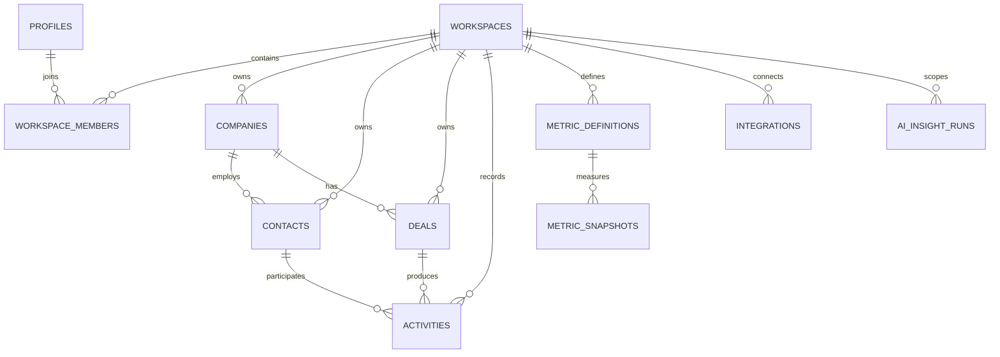
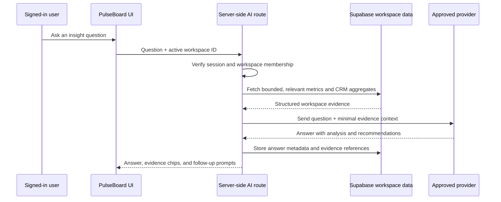

# PulseBoard AI — Complete Product Blueprint

> **Positioning:** An AI-powered SaaS analytics and customer-intelligence workspace that helps small product teams understand customer health, revenue momentum, support pressure, and engineering activity from one secure dashboard.

**Prepared for:** Abbas Hussain  
**Project type:** Portfolio-grade full-stack SaaS  
**Recommended stack:** Next.js, TypeScript, Tailwind CSS, Supabase PostgreSQL, Supabase Auth, server-side AI routing, GitHub integration, Vercel deployment.

---

## 1. Product vision

PulseBoard AI should feel like a compact blend of a CRM, an analytics workspace, and an AI business analyst. Its purpose is not to imitate a huge enterprise platform. Instead, it should solve a clear problem for a small SaaS team: customer, deal, support, and product signals are scattered, so the team cannot quickly see what needs attention.

The user signs in, creates a workspace, adds customers and deals, optionally connects a GitHub repository, records or imports recurring metrics, and receives a dashboard that explains what changed. The AI assistant answers questions such as: **“Which customer accounts are at risk?”**, **“Why did our weekly conversion rate fall?”**, and **“Which release may have caused a support spike?”**

### Portfolio objective

This project should demonstrate that Abbas can design and build a practical multi-tenant SaaS product, not only an AI chat interface. It should show strong capability in data modeling, row-level security, dashboards, server-side integrations, responsive UI, and explainable AI features.

| Portfolio signal | How PulseBoard AI proves it |
| --- | --- |
| **Vercel-oriented engineering** | Next.js App Router, route handlers, typed server boundaries, deployment-ready environment configuration, and polished product UX. |
| **Supabase capability** | PostgreSQL schema, Supabase Auth, Row Level Security, realtime-ready tables, migrations, and storage-safe imports. |
| **HubSpot-style product thinking** | Contacts, companies, deals, activities, pipeline stages, customer health, segments, and CRM workflows. |
| **GitHub developer tooling** | OAuth connection, repository activity sync, pull-request/release signals, and repository-aware business insights. |
| **AI product design** | AI answers are based on workspace-scoped structured data, show their evidence, and never expose secrets in the browser. |

---

## 2. Target users and roles

The first release should focus on one clear audience: founders and small SaaS teams with a small number of customers and a simple sales pipeline. Avoid trying to support every enterprise role or industry in version one.

| User role | Goal | Access |
| --- | --- | --- |
| **Workspace owner** | Creates the workspace, invites members, manages integrations, and controls data exports. | Full workspace access. |
| **Admin** | Maintains CRM records, deals, metrics, and integrations. | Full operational access without ownership transfer. |
| **Member** | Reviews dashboards, adds activities, updates assigned contacts and deals. | Scoped workspace access. |
| **Viewer** | Reads dashboards and saved reports without changing data. | Read-only workspace access. |

> **Product rule:** Every business record belongs to exactly one workspace. A user must never be able to access another workspace simply by modifying a URL or API request.

---

## 3. MVP scope

The MVP must be real and useful with no fake dashboard data. A new workspace should begin with clear empty states, manual data entry, and optional CSV import. Sample demo data can exist only behind an explicit **“Load demo workspace”** button and must never be silently mixed with real customer data.

### Core modules

| Module | First-release scope | Why it matters |
| --- | --- | --- |
| **Auth and onboarding** | Email/password authentication, sign in, sign up, workspace creation, team role selection. | Establishes a real multi-tenant SaaS foundation. |
| **Executive dashboard** | Revenue trend, active customers, open pipeline value, at-risk accounts, support volume, and engineering activity. | Provides the primary reason to return to the product. |
| **Customer CRM** | Contacts, companies, lifecycle stage, owner, tags, notes, health score, and activity timeline. | Demonstrates HubSpot-style customer data workflows. |
| **Deal pipeline** | Deals, stages, amount, expected close date, probability, and owner. | Connects customer information to revenue visibility. |
| **Metrics center** | Metric definitions, daily/weekly snapshots, CSV import, source metadata, and trend charts. | Makes dashboard figures auditable instead of decorative. |
| **AI analyst** | Workspace-scoped questions, structured evidence references, suggested follow-up questions, and safe general guidance. | Shows responsible AI product design. |
| **GitHub connector** | Connect one or more repositories, select repositories, sync public metadata such as issues, pull requests, and releases. | Adds a developer-product signal relevant to GitHub and Vercel. |
| **Reports** | Saved filters, printable/shareable report view, CSV export, and scheduled-report design placeholder. | Shows business workflow maturity. |
| **Audit and settings** | Membership, roles, integrations, data export, activity/audit log, and account controls. | Shows security awareness and operational polish. |

### Deliberately out of scope for v1

Payment processing, full marketing-email automation, two-way HubSpot sync, real-time webhook infrastructure, team billing, predictive ML training, and public anonymous dashboards should not be built in the first version. They can appear as carefully labeled future roadmap items rather than incomplete buttons.

---

## 4. Data model and Supabase PostgreSQL schema

### Relationship map



### Core tables

| Table | Key fields | Purpose |
| --- | --- | --- |
| `profiles` | `id`, `full_name`, `avatar_url`, `created_at` | Extends the Supabase auth user with public profile details. |
| `workspaces` | `id`, `name`, `slug`, `owner_id`, `industry`, `created_at` | The tenant boundary for every business record. |
| `workspace_members` | `workspace_id`, `user_id`, `role`, `joined_at` | Links users to workspaces and enforces owner/admin/member/viewer roles. |
| `companies` | `id`, `workspace_id`, `name`, `domain`, `industry`, `lifecycle_stage`, `health_score`, `owner_id` | CRM account record and customer-health home. |
| `contacts` | `id`, `workspace_id`, `company_id`, `email`, `first_name`, `last_name`, `job_title`, `owner_id` | Individual customer or prospect record. |
| `deals` | `id`, `workspace_id`, `company_id`, `name`, `stage`, `amount_cents`, `probability`, `expected_close_date`, `owner_id` | Revenue pipeline and forecasting data. |
| `activities` | `id`, `workspace_id`, `company_id`, `contact_id`, `deal_id`, `type`, `body`, `occurred_at`, `created_by` | Notes, calls, emails, meetings, and system events. |
| `metric_definitions` | `id`, `workspace_id`, `key`, `name`, `unit`, `aggregation`, `description` | Defines a metric before any value is plotted. |
| `metric_snapshots` | `id`, `workspace_id`, `metric_definition_id`, `value_numeric`, `period_start`, `period_end`, `source` | Time-series values that power real charts. |
| `integrations` | `id`, `workspace_id`, `provider`, `status`, `config_encrypted`, `last_synced_at` | Stores a provider connection; sensitive fields stay encrypted server-side. |
| `sync_runs` | `id`, `integration_id`, `status`, `started_at`, `completed_at`, `records_written`, `error_summary` | Creates an operational history for imports and connector syncs. |
| `ai_insight_runs` | `id`, `workspace_id`, `created_by`, `question`, `answer`, `evidence_json`, `provider_label`, `created_at` | Stores AI answers with evidence references, never raw provider secrets. |
| `saved_views` | `id`, `workspace_id`, `created_by`, `name`, `entity_type`, `filters_json`, `is_shared` | Saves CRM and report filters. |
| `audit_logs` | `id`, `workspace_id`, `actor_id`, `action`, `entity_type`, `entity_id`, `metadata_json`, `created_at` | Records sensitive configuration, member, import, and export events. |

### SQL foundation

```sql
create type public.workspace_role as enum ('owner', 'admin', 'member', 'viewer');
create type public.deal_stage as enum ('lead', 'qualified', 'proposal', 'negotiation', 'won', 'lost');
create type public.activity_type as enum ('note', 'call', 'email', 'meeting', 'task', 'system');

create table public.workspaces (
  id uuid primary key default gen_random_uuid(),
  owner_id uuid not null references auth.users(id) on delete restrict,
  name text not null check (char_length(name) between 2 and 80),
  slug text not null unique check (slug ~ '^[a-z0-9]+(?:-[a-z0-9]+)*$'),
  industry text,
  created_at timestamptz not null default now(),
  updated_at timestamptz not null default now()
);

create table public.workspace_members (
  workspace_id uuid not null references public.workspaces(id) on delete cascade,
  user_id uuid not null references auth.users(id) on delete cascade,
  role public.workspace_role not null default 'member',
  joined_at timestamptz not null default now(),
  primary key (workspace_id, user_id)
);

create table public.companies (
  id uuid primary key default gen_random_uuid(),
  workspace_id uuid not null references public.workspaces(id) on delete cascade,
  owner_id uuid references auth.users(id) on delete set null,
  name text not null,
  domain text,
  industry text,
  lifecycle_stage text not null default 'lead',
  health_score smallint check (health_score between 0 and 100),
  tags text[] not null default '{}',
  created_at timestamptz not null default now(),
  updated_at timestamptz not null default now(),
  unique (workspace_id, name)
);

create table public.metric_definitions (
  id uuid primary key default gen_random_uuid(),
  workspace_id uuid not null references public.workspaces(id) on delete cascade,
  key text not null,
  name text not null,
  unit text not null check (unit in ('count', 'currency_cents', 'percent', 'duration_seconds')),
  aggregation text not null check (aggregation in ('sum', 'average', 'latest')),
  description text,
  created_at timestamptz not null default now(),
  unique (workspace_id, key)
);

create table public.metric_snapshots (
  id uuid primary key default gen_random_uuid(),
  workspace_id uuid not null references public.workspaces(id) on delete cascade,
  metric_definition_id uuid not null references public.metric_definitions(id) on delete cascade,
  value_numeric numeric not null,
  period_start date not null,
  period_end date not null,
  source text not null default 'manual',
  created_at timestamptz not null default now(),
  check (period_end >= period_start),
  unique (metric_definition_id, period_start, period_end, source)
);

create index companies_workspace_health_idx on public.companies (workspace_id, health_score);
create index metric_snapshots_workspace_period_idx on public.metric_snapshots (workspace_id, period_start desc);
```

### Row Level Security design

Enable RLS on every workspace table. Create a reusable security-definer helper function named `is_workspace_member(target_workspace_id uuid)` that checks `workspace_members` against `auth.uid()`. Standard members may read workspace records and create activities. Admins may manage CRM records and integrations. Only owners may transfer workspace ownership or delete a workspace.

```sql
alter table public.companies enable row level security;

create policy "Workspace members can read companies"
on public.companies for select
using (public.is_workspace_member(workspace_id));

create policy "Admins can manage companies"
on public.companies for all
using (public.has_workspace_role(workspace_id, array['owner', 'admin']::public.workspace_role[]))
with check (public.has_workspace_role(workspace_id, array['owner', 'admin']::public.workspace_role[]));
```

The service-role key must be used only by trusted server routes for operations that are impossible with a user session, such as controlled webhook processing, encrypted integration-token operations, and scheduled sync jobs.

---

## 5. AI analyst design

PulseBoard should not pretend that the AI can see information that does not exist. The assistant must state whether it is using workspace evidence, selected report data, or general business knowledge.

### AI answer flow



| Rule | Product behavior |
| --- | --- |
| **Workspace scoping** | The server verifies membership before reading any metrics, contacts, or deals. |
| **Evidence first** | AI responses display the date range, metric names, or record counts used for the answer. |
| **Minimal context** | The route sends aggregate statistics and selected records, not the entire database. |
| **No secret exposure** | Provider keys exist only in server environment variables. |
| **Safe fallbacks** | General business guidance may use a resilient fallback chain, but sensitive workspace data uses the stricter source-analysis policy. |
| **Honest uncertainty** | If no metric history exists, the assistant asks the user to import or enter data rather than inventing a trend. |

---

## 6. Screen system and user flows

### Screen list

| Screen | Primary content | Key actions |
| --- | --- | --- |
| **Marketing landing page** | Product statement, capability highlights, product shots, CTA, security statement. | Sign up, sign in, open live demo. |
| **Authentication** | Sign in, sign up, email verification, password reset. | Authenticate securely. |
| **Workspace onboarding** | Workspace name, industry, team role, first success checklist. | Create tenant and choose data-entry route. |
| **Executive dashboard** | KPI cards, revenue/pipeline chart, customer-health list, AI insight panel, activity feed. | Change date range, drill into a metric, ask AI. |
| **Customers** | Searchable company table, health badges, lifecycle filters, bulk import action. | Create company, filter, open detail. |
| **Company detail** | Company profile, contacts, deals, customer health, timeline, notes. | Add contact, note, activity, deal, risk reason. |
| **Deals pipeline** | Kanban/list view by stage, weighted pipeline value, forecast side panel. | Move stage, create deal, filter owner. |
| **Metrics center** | Metric cards, trend charts, import history, metric definitions. | Add metric, CSV import, edit definition. |
| **AI analyst** | Conversation with evidence cards, saved insight history, suggested questions. | Ask workspace question, inspect evidence, save report. |
| **Integrations** | GitHub connection state, selected repositories, sync status, data source status. | Connect, select repo, start controlled sync. |
| **Reports** | Saved views, report builder, export actions, print-ready layout. | Save view, export CSV, share internally. |
| **Settings** | Team members, role management, workspace details, data export, audit history. | Invite member, change role, revoke integration. |

### Key user flows

#### Flow A — First workspace

1. The user signs up and lands on a concise onboarding screen.
2. They name their workspace and select an industry.
3. PulseBoard creates the workspace and an `owner` membership in a single transaction.
4. The dashboard opens with an honest empty state and three choices: add a company, create a metric, or load explicit demo data.
5. Completing any one choice turns the first-success checklist into real progress.

#### Flow B — Identify an at-risk customer

1. The user opens the dashboard and taps the **At risk accounts** card.
2. The customer list opens pre-filtered by health score below a chosen threshold.
3. The user opens a company detail page to see recent notes, support-like activities, stalled deals, and metric changes.
4. They add a follow-up task or ask the AI: **“Summarize why this account may be at risk.”**
5. The AI returns a concise answer with the actual workspace evidence it used.

#### Flow C — Import performance metrics

1. The user opens Metrics and chooses CSV import.
2. The import wizard validates headers, previews rows, maps each column to a metric definition, and explains any rejected row.
3. The server stores validated snapshots in one workspace-scoped transaction.
4. The dashboard refreshes with charts built from these real snapshots.
5. The import and record count appear in `sync_runs` and `audit_logs`.

#### Flow D — Connect GitHub activity

1. The owner opens Integrations and explicitly starts the GitHub OAuth flow.
2. The server stores the returned token encrypted and lists accessible repositories.
3. The owner selects repositories and approves the data scope before sync.
4. A sync retrieves only the chosen permitted metadata, stores a summary, and reports status.
5. The dashboard shows engineering activity as a separate signal rather than falsely claiming it is revenue data.

---

## 7. Design direction

PulseBoard must look different from DevDesk while preserving Abbas’s premium visual signature. DevDesk is a dark developer workspace. PulseBoard should feel like a high-trust business command center: brighter data surfaces, more whitespace, and clearer chart hierarchy.

### Brand system

| Design token | Choice | Reason |
| --- | --- | --- |
| **Primary background** | `#07111F` deep navy | Gives an analytical, professional foundation without copying pure-black DevDesk. |
| **Surface** | `#0D1B2A` with `#17304A` border | Creates layered cards suitable for charts and tables. |
| **Primary accent** | `#22D3EE` pulse cyan | Represents live data and provides a recognizable brand signal. |
| **Secondary accent** | `#8B5CF6` intelligence violet | Marks AI-generated insight surfaces and assistant actions. |
| **Positive status** | `#34D399` emerald | Reserved for healthy customer and positive trend indicators. |
| **Risk status** | `#FB7185` rose | Reserved for churn risk, overdue actions, and error states. |
| **Warning status** | `#FBBF24` amber | Used for incomplete imports and attention-required states. |
| **Typography** | Inter for UI; JetBrains Mono for metric values and technical labels | Keeps tables readable and data values precise. |

### Layout principles

On desktop, use a fixed left navigation rail, a compact top command bar, and a responsive twelve-column content grid. KPI cards should appear first, then the primary performance chart, then a two-column set of customer health and AI insight panels. Tables should use sticky headers and clear empty states.

On a Galaxy A21s or similar mobile screen, the design must remain one-handed. Replace the desktop rail with a bottom navigation bar containing **Home**, **Customers**, **AI**, **Reports**, and **More**. Use full-width KPI cards in a horizontally scrollable row only when labels remain visible. Charts should never be unreadably compressed; show fewer series, use a date-range sheet, and allow drill-down into a dedicated chart screen.

### Interaction details

| Component | Behavior |
| --- | --- |
| **KPI card** | Shows value, period comparison, trend icon, and a tap target that opens the filtered underlying records. |
| **AI insight card** | Uses violet edge glow, summary first, evidence chips second, and no misleading confidence percentage. |
| **Customer-health badge** | Uses text plus color—such as “Healthy”, “Watch”, or “At risk”—so color is not the only signal. |
| **Data table** | Supports search, filters, saved views, keyboard navigation on desktop, and a mobile card alternative. |
| **Import wizard** | Uses step labels, column mapping preview, error rows, and an explicit final confirmation. |
| **Destructive action** | Uses confirmation dialogs with the record name and clear non-destructive cancel action. |

---

## 8. API and server boundaries

| Route group | Example route | Server responsibility |
| --- | --- | --- |
| **Workspace** | `POST /api/workspaces` | Validate session, create workspace and owner membership atomically. |
| **CRM** | `GET /api/companies`, `POST /api/deals` | Check membership, validate input with Zod, and query only active workspace rows. |
| **Metrics import** | `POST /api/metrics/import` | Validate CSV, enforce size limits, map columns, and write audited snapshots. |
| **Dashboard** | `GET /api/dashboard?range=30d` | Aggregate workspace-scoped metrics efficiently and return chart-ready data. |
| **AI analyst** | `POST /api/ai/insights` | Enforce workspace membership, assemble minimal evidence, route server-side AI request, and store auditable result metadata. |
| **GitHub connector** | `/api/github/*` | Run OAuth server-side, encrypt token material, scope sync to approved repositories. |
| **Exports** | `POST /api/reports/export` | Generate authorized CSV/PDF-ready data and add an audit log entry. |

Every write route should use Zod validation, tenant checks, error codes suitable for the UI, and an audit-log event where data or access changes. Never use the Supabase service-role key directly in browser code.

---

## 9. Testing and quality plan

| Test level | Must verify |
| --- | --- |
| **Unit tests** | Metric calculation, health-score formula, CSV validation, role guard helpers, AI evidence sanitization. |
| **Route tests** | Unauthenticated requests fail, cross-workspace access fails, owners/admins have expected writes, viewers remain read-only. |
| **Database tests** | RLS blocks tenant leakage, cascade behavior is correct, unique metric snapshots reject duplicates. |
| **Integration tests** | Onboarding creates workspace membership, CSV import creates valid snapshots, GitHub sync records status safely. |
| **UI tests** | Empty states, customer filter behavior, mobile navigation, accessible dialog exits, chart drill-down. |
| **Production checklist** | Build passes, environment variables are present only server-side, security headers are configured, and live dashboard has no console errors. |

---

## 10. Development roadmap

### Milestone 1 — SaaS foundation

Build the Next.js project, visual shell, Supabase Auth, profiles, workspaces, membership roles, RLS helpers, and onboarding. Success means two different accounts can create separate workspaces and cannot access each other’s data.

### Milestone 2 — CRM and pipeline

Implement companies, contacts, deals, activities, customer detail pages, customer list filters, pipeline stages, and audit logging. Success means an owner can create real customer data and trace updates in a timeline.

### Milestone 3 — Metrics and dashboard

Implement metric definitions, CSV import, chart-ready dashboard aggregation, date ranges, and metric drill-down. Success means dashboard values are always backed by actual snapshots or an honest empty state.

### Milestone 4 — AI analyst

Implement workspace-scoped AI insight questions, evidence chips, server-side routing, safe provider fallback behavior, and insight history. Success means the assistant can explain imported data without accessing another workspace.

### Milestone 5 — GitHub and reports

Implement GitHub OAuth connector, encrypted server token storage, repository selection, limited activity sync, saved reports, and CSV export. Success means repository access and report exports are fully reviewable.

### Milestone 6 — Portfolio polish

Finish mobile responsiveness, visual motion, accessibility, README, architecture diagrams, test coverage, screenshots, and Vercel deployment. Success means a recruiter can understand the product in less than two minutes from the landing page, live demo, and repository README.

---

## 11. Portfolio showcase copy

> **PulseBoard AI** is an AI-powered customer intelligence and SaaS analytics workspace built with Next.js, TypeScript, Supabase PostgreSQL, Row Level Security, server-side AI routing, and GitHub repository integrations. It helps small product teams connect customer health, sales pipeline, business metrics, and engineering activity in one secure, explainable dashboard.

### Suggested README shields

```markdown


```

---

## 12. Definition of done

PulseBoard AI is ready to showcase when the user can create a real workspace, add or import actual records, see only workspace-scoped data, obtain an evidence-based AI summary, connect a permitted GitHub repository, export a report, and use the dashboard comfortably on both desktop and a narrow Android phone. The repository should include a high-quality README, database schema, tests, screenshots, live Vercel link, and a clear statement that no external AI provider can offer an absolute zero-error guarantee.
